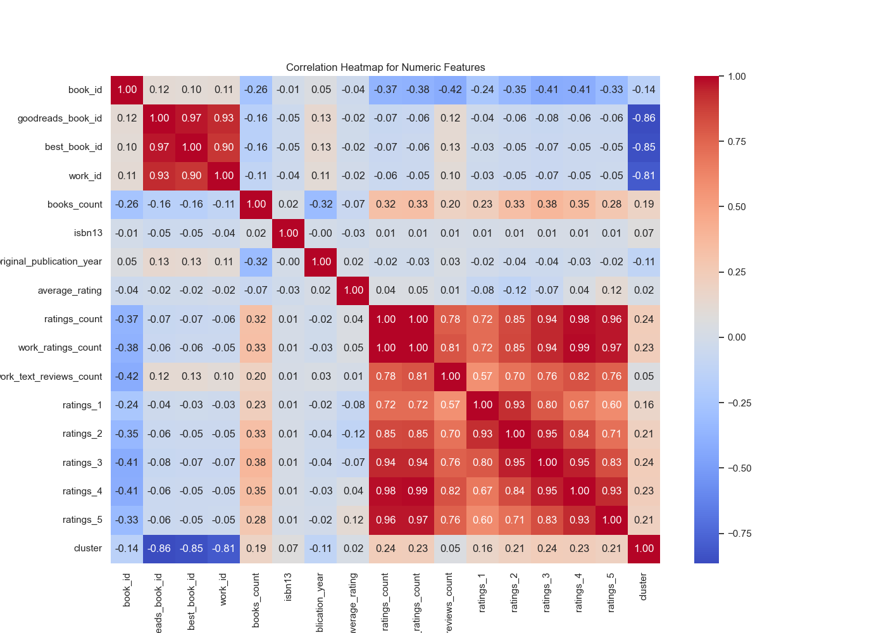
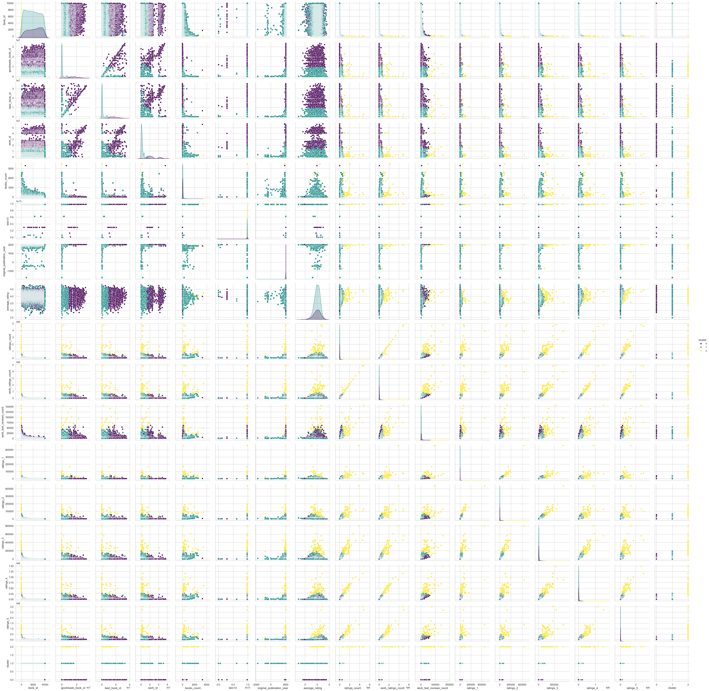
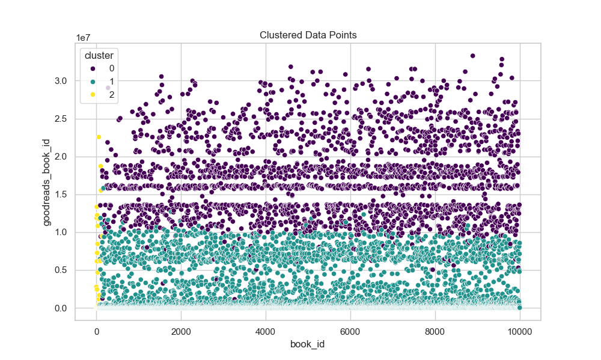

Based on the provided dataset summary from the `goodreads.csv` file, here are some insights and suggestions for further analysis:

### Insights

1. **Overall Data Characteristics**:
   - The data contains **10,000 books**, with various attributes tracked such as ratings, publication years, and authors, among others.
   - There are notable missing values in fields like `isbn`, `isbn13`, `original_publication_year`, and `original_title`, which may need addressing before detailed analysis.

2. **Authors & Popularity**:
   - The dataset includes **4,664 unique authors**, with Stephen King being the most frequently appearing author (60 occurrences). This indicates a concentration of certain authors within the dataset.
   - The `ratings_count` and `work_ratings_count` show a wide range (from 2,716 to 4,780,653), indicating varying levels of popularity and engagement across different books.

3. **Ratings Distribution**:
   - The average rating of the books is approximately **4.00**, which suggests a generally positive sentiment among readers.
   - The distribution of rating counts shows more significant numbers of books receiving higher ratings (4 and 5 stars), indicating favorable perceptions of these books.

4. **Correlation Analysis**:
   - The correlation matrix reveals strong correlations between various rating fields (e.g., `ratings_count` and `work_ratings_count`), suggesting that books with more ratings tend to have higher overall engagement.
   - Negative correlations between `books_count` and rating metrics may indicate that an increase in the number of books per author is associated with a decrease in ratings, possibly due to quality dilution in extensive bibliographies.

5. **Outliers**:
   - The parameters like `goodreads_book_id`, `best_book_id`, and `work_id` showed outliers which might indicate anomalies that could skew the data analysis. Identifying the cause of these anomalies would be essential for understanding how they affect overall trends.

### Suggestions for Further Analysis

1. **Handling Missing Data**:
   - Investigate and impute the missing values systematically for fields like `isbn`, `original_title`, `original_publication_year`, and `language_code`. Techniques like mean/mode imputation could be employed, or more advanced approaches such as K-Nearest Neighbors (KNN) imputation.

2. **Sentiment Analysis on Reviews**:
   - If available, extract user reviews and perform sentiment analysis to assess whether a higher average rating correlates with more positive reviews. This can deepen the understanding of why a book is rated highly.

3. **Temporal Analysis**:
   - Analyze trends in publication years to see if certain periods yield more highly-rated books. For instance, are newer publications rated better than older classics? This could be insightful for marketing strategies.

4. **Author Analysis**:
   - Explore the effect of the number of books an author has on their average rating. This could include a more granular analysis of prolific authors versus those with fewer titles.

5. **Clustering Analysis**:
   - Utilize clustering methods to identify patterns among books based on features such as average rating, ratings count, and publication year. This could yield insights into categories of books that perform similarly, which is beneficial for recommendations.

6. **Visualization**:
   - Visualize key distributions (e.g., by using histograms or box plots for ratings) to illustrate how ratings differ among various groups (e.g., genres, popular authors).
   - Generate additional plots beyond those provided, like heatmaps for correlation and trend lines over time for average ratings or publishing trends.

These insights and suggestions create a roadmap for deeper analysis and enhance understanding of the dataset's trends, patterns, and potential areas of interest for readers and publishers alike.

### Data Visualizations
#### Correlation Heatmap

#### Pairplot

#### Cluster Scatter Plot

